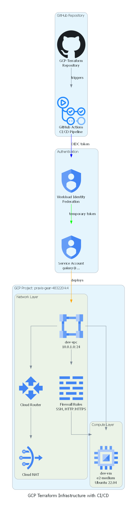

# 📊 Architecture Diagram Generator

## Overview

This script generates professional architecture diagrams for your GCP Terraform infrastructure.

## Prerequisites

Install the required Python package:

```bash
# Activate your virtual environment (if using one)
.venv\Scripts\activate

# Install diagrams library
pip install diagrams

# Install Graphviz (required for diagrams)
# Windows: Download from https://graphviz.org/download/
# Or use chocolatey: choco install graphviz
```

## Usage

### Generate All Diagrams

```bash
# Run the script
python generate-architecture-diagram.py
```

### Generated Diagrams

The script creates 3 professional diagrams:

1. **gcp-infrastructure-architecture.png**
   - Complete infrastructure overview
   - Shows GitHub Actions, WIF, and GCP resources
   - Includes authentication flow

2. **gcp-network-architecture.png**
   - Network-focused diagram
   - Shows VPC, subnets, NAT, firewall
   - Illustrates traffic flow

3. **cicd-pipeline-flow.png**
   - CI/CD pipeline visualization
   - Shows workflow stages
   - Demonstrates deployment process

## What the Diagrams Show

### Infrastructure Diagram
```
GitHub Repository
    ↓
GitHub Actions CI/CD
    ↓
Workload Identity Federation (WIF)
    ↓
Service Account
    ↓
GCP Infrastructure
    ├── VPC Network
    ├── Cloud Router & NAT
    ├── Firewall Rules
    └── VM Instance
```

### Network Diagram
```
Internet
    ↓ (inbound)
Firewall Rules (SSH, HTTP/HTTPS)
    ↓
VM Instance (Private IP: 10.0.1.2)
    ↓ (outbound)
Cloud NAT → Cloud Router → Internet
```

### CI/CD Flow Diagram
```
Developer Push
    ↓
Validate & Lint
    ↓
Security Scan
    ↓
Terraform Plan
    ↓
Terraform Apply
    ↓
WIF Authentication (Keyless)
    ↓
Deploy to GCP
```

## Customization

Edit `generate-architecture-diagram.py` to:
- Change diagram colors
- Add/remove components
- Modify labels
- Adjust layout direction

### Example Customizations

```python
# Change diagram direction
direction="LR"  # Left to Right
direction="TB"  # Top to Bottom

# Change edge colors
Edge(label="connection", color="blue")
Edge(label="connection", color="red")
Edge(label="connection", color="green")

# Change background
graph_attr = {
    "bgcolor": "white",  # or "transparent"
}
```

## Troubleshooting

### Issue: "graphviz not found"

**Solution**:
```bash
# Windows
choco install graphviz

# Or download from: https://graphviz.org/download/
# Add to PATH: C:\Program Files\Graphviz\bin
```

### Issue: "diagrams module not found"

**Solution**:
```bash
pip install diagrams
```

### Issue: "Permission denied"

**Solution**:
```bash
# Run as administrator or check file permissions
```

## Output Location

Diagrams are saved in the project root directory:
```
GCP-Terraform/
├── gcp-infrastructure-architecture.png
├── gcp-network-architecture.png
└── cicd-pipeline-flow.png
```

## Using in Documentation

### Markdown
```markdown

```

### HTML
```html

```

### Presentations
- Drag and drop PNG files into PowerPoint, Google Slides, etc.
- High-quality images suitable for presentations

## Benefits

✅ **Professional**: Clean, standardized diagrams  
✅ **Automated**: Generate with one command  
✅ **Customizable**: Easy to modify and extend  
✅ **Version Control**: Diagrams as code  
✅ **Consistent**: Same style across all diagrams

## Examples

The generated diagrams show:
- Your complete GCP infrastructure
- Network topology and traffic flow
- CI/CD pipeline stages
- Authentication mechanisms
- Component relationships

Perfect for:
- Documentation
- Presentations
- Architecture reviews
- Team onboarding
- Portfolio projects

## Additional Resources

- **Diagrams Library**: https://diagrams.mingrammer.com/
- **Graphviz**: https://graphviz.org/
- **GCP Icons**: https://cloud.google.com/icons

---

**Generate your diagrams now**:
```bash
python generate-architecture-diagram.py
```

**View the results**: Open the PNG files in your project directory!