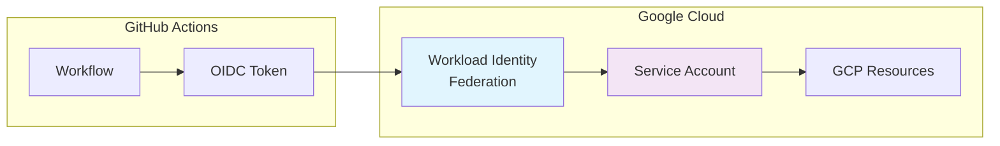
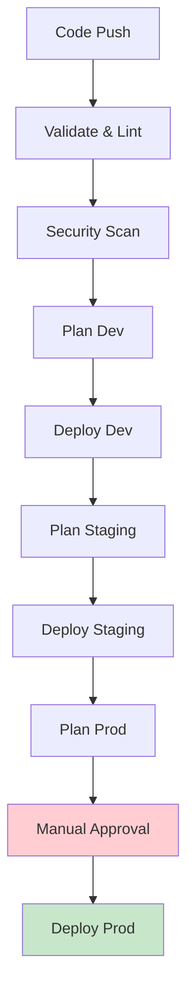
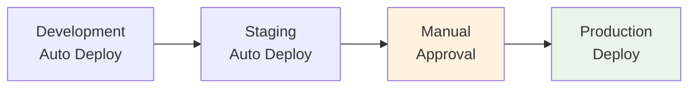

# 🏗️ GCP Directory-Based Terraform Project
## Complete Enterprise Infrastructure with Multi-Environment Setup

> **🎯 Project Overview**: Production-ready Google Cloud Platform infrastructure managed with Terraform using directory-based environment separation, Workload Identity Federation, and automated CI/CD pipelines.

---

## 📋 Table of Contents

1. [🎯 Project Overview](#-project-overview)
2. [🏗️ Architecture Summary](#️-architecture-summary)
3. [📁 Directory Structure](#-directory-structure)
4. [🚀 Quick Start Guide](#-quick-start-guide)
5. [🌍 Environment Details](#-environment-details)
6. [🔐 Security Implementation](#-security-implementation)
7. [🔄 CI/CD Pipeline](#-cicd-pipeline)
8. [📊 Monitoring & Operations](#-monitoring--operations)
9. [🛠️ Development Workflow](#️-development-workflow)
10. [📚 Documentation Index](#-documentation-index)

---

## 🎯 Project Overview

### What This Project Provides

This is a **complete, production-ready GCP infrastructure project** that demonstrates enterprise-grade Terraform practices with:

- ✅ **Multi-Environment Setup**: Separate dev/staging/production environments
- ✅ **Zero-Trust Security**: Workload Identity Federation (no service account keys)
- ✅ **Infrastructure as Code**: 100% Terraform-managed resources
- ✅ **Automated CI/CD**: GitHub Actions with approval gates
- ✅ **Modular Design**: Reusable Terraform modules
- ✅ **Enterprise Patterns**: Best practices for team collaboration

### 🎯 Target Audience

| Audience | Use Case |
|----------|----------|
| **DevOps Engineers** | Learn enterprise Terraform patterns |
| **Cloud Architects** | Reference architecture for GCP |
| **Platform Teams** | Foundation for multi-tenant infrastructure |
| **Students/Learners** | Complete real-world example |
| **Interview Candidates** | Demonstrate infrastructure expertise |

---

## 🏗️ Architecture Summary

### High-Level Architecture

```
┌─────────────────────────────────────────────────────────────────┐
│                    Google Cloud Platform                        │
│                  Project: praxis-gear-483220-k4                │
└─────────────────────────────────────────────────────────────────┘
                              │
        ┌─────────────────────┼─────────────────────┐
        │                     │                     │
┌───────▼────────┐   ┌────────▼────────┐   ┌───────▼────────┐
│  Development   │   │    Staging      │   │  Production    │
│  Environment   │   │   Environment   │   │  Environment   │
│                │   │                 │   │                │
│ • dev-vpc      │   │ • staging-vpc   │   │ • prod-vpc     │
│ • dev-vm       │   │ • staging-vm    │   │ • prod-vm      │
│ • e2-micro     │   │ • e2-small      │   │ • e2-medium    │
└────────────────┘   └─────────────────┘   └────────────────┘
```

### 🔧 Core Components

| Component | Purpose | Implementation |
|-----------|---------|----------------|
| **VPC Networks** | Network isolation | Separate VPC per environment |
| **Compute Instances** | Application hosting | Right-sized VMs per environment |
| **Cloud NAT** | Outbound internet access | Secure egress without external IPs |
| **Firewall Rules** | Network security | Least-privilege access controls |
| **Service Accounts** | Identity management | Environment-specific identities |
| **Workload Identity** | CI/CD authentication | Keyless GitHub Actions access |

---

## 📁 Directory Structure

### Complete Project Layout

```
gcp-terraform-infrastructure/
├── 📁 environments/                    # Environment-specific configurations
│   ├── 📁 dev/                        # Development environment
│   │   ├── main.tf                    # Root module for dev
│   │   ├── variables.tf               # Dev-specific variables
│   │   ├── outputs.tf                 # Dev outputs
│   │   └── terraform.tfvars           # Dev values
│   ├── 📁 staging/                    # Staging environment
│   │   ├── main.tf                    # Root module for staging
│   │   ├── variables.tf               # Staging-specific variables
│   │   ├── outputs.tf                 # Staging outputs
│   │   └── terraform.tfvars           # Staging values
│   └── 📁 prod/                       # Production environment
│       ├── main.tf                    # Root module for prod
│       ├── variables.tf               # Prod-specific variables
│       ├── outputs.tf                 # Prod outputs
│       └── terraform.tfvars           # Prod values
├── 📁 modules/                        # Reusable Terraform modules
│   ├── 📁 network/                    # VPC and networking
│   │   ├── main.tf                    # Network resources
│   │   ├── variables.tf               # Network variables
│   │   └── outputs.tf                 # Network outputs
│   ├── 📁 compute/                    # Compute instances
│   │   ├── main.tf                    # VM resources
│   │   ├── variables.tf               # Compute variables
│   │   └── outputs.tf                 # Compute outputs
│   ├── 📁 security/                   # Firewall rules
│   │   ├── main.tf                    # Security resources
│   │   ├── variables.tf               # Security variables
│   │   └── outputs.tf                 # Security outputs
│   └── 📁 iam/                        # IAM and service accounts
│       ├── main.tf                    # IAM resources
│       ├── variables.tf               # IAM variables
│       └── outputs.tf                 # IAM outputs
├── 📁 shared/                         # Shared infrastructure
│   └── 📁 wif/                        # Workload Identity Federation
│       ├── main.tf                    # WIF configuration
│       ├── variables.tf               # WIF variables
│       └── outputs.tf                 # WIF outputs
├── 📁 .github/                        # GitHub Actions workflows
│   └── 📁 workflows/
│       └── cicd-pipeline.yml          # Complete CI/CD pipeline
├── 📁 scripts/                        # Utility scripts
│   ├── development-startup.sh         # Dev environment setup
│   ├── staging-startup.sh             # Staging environment setup
│   └── production-startup.sh          # Prod environment setup
├── 📁 docs/                           # Documentation
│   ├── 📁 architecture/               # Architecture diagrams
│   ├── 📁 runbooks/                   # Operational procedures
│   └── 📁 security/                   # Security documentation
├── 📁 info/                           # Learning materials
│   ├── INTERVIEW-MASTER-GUIDE.md      # Complete interview guide
│   ├── TERRAFORM-STATE-EXPLAINED.md   # State management guide
│   └── WIF-QUICK-REFERENCE.md         # WIF setup guide
├── 📄 README.md                       # Project overview
├── 📄 GCP-TERRAFORM-ARCHITECTURE-OVERVIEW.md  # Complete architecture
├── 📄 TERRAFORM-MASTERY-ACADEMY-COMPLETE.md   # Learning platform
├── 📄 Makefile                        # Automation commands
└── 📄 .gitignore                      # Git ignore rules
```

### 🎯 Directory Purpose Explanation

#### `/environments/` - Environment Separation
- **Purpose**: Complete isolation between dev/staging/prod
- **Pattern**: Directory-based (not workspace-based)
- **Benefits**: Independent state, different configurations, team collaboration

#### `/modules/` - Reusable Components
- **Purpose**: DRY principle, consistent resource creation
- **Pattern**: Input variables → Resources → Outputs
- **Benefits**: Maintainability, testing, standardization

#### `/shared/` - Cross-Environment Resources
- **Purpose**: Resources used by multiple environments
- **Example**: Workload Identity Federation pool
- **Benefits**: Single source of truth, cost optimization

#### `/.github/workflows/` - Automation
- **Purpose**: CI/CD pipeline for infrastructure
- **Pattern**: Validate → Plan → Deploy with approvals
- **Benefits**: Consistent deployments, audit trail

---

## 🚀 Quick Start Guide

### Prerequisites

```bash
# Required tools
terraform --version    # >= 1.0
gcloud --version      # Latest
git --version         # Latest
gh --version          # GitHub CLI (optional)
```

### 1. Clone and Setup

```bash
# Clone the repository
git clone https://github.com/YOUR_USERNAME/gcp-terraform-infrastructure.git
cd gcp-terraform-infrastructure

# Set up GCP authentication
gcloud auth login
gcloud config set project YOUR_PROJECT_ID
```

### 2. Deploy Shared Infrastructure

```bash
# Deploy Workload Identity Federation (one-time setup)
cd shared/wif
terraform init
terraform plan -var="project_id=YOUR_PROJECT_ID" -var="github_repository=YOUR_ORG/YOUR_REPO"
terraform apply
cd ../..
```

### 3. Deploy Development Environment

```bash
# Deploy development environment
cd environments/dev
terraform init
terraform plan -var-file="terraform.tfvars"
terraform apply
cd ../..
```

### 4. Verify Deployment

```bash
# Check resources
gcloud compute instances list
gcloud compute networks list
gcloud iam service-accounts list
```

---

## 🌍 Environment Details

### Environment Specifications

| Environment | Instance Type | vCPUs | Memory | Disk | Network | Purpose |
|-------------|---------------|-------|--------|------|---------|---------|
| **Development** | e2-micro | 1 | 1GB | 10GB SSD | 10.0.0.0/24 | Development & testing |
| **Staging** | e2-small | 2 | 2GB | 20GB SSD | 10.1.0.0/24 | Pre-production validation |
| **Production** | e2-medium | 2 | 4GB | 50GB SSD | 10.2.0.0/24 | Production workloads |

### Environment-Specific Configurations

#### Development Environment
```hcl
# environments/dev/terraform.tfvars
project_id = "praxis-gear-483220-k4"
environment = "dev"
region = "us-central1"
zone = "us-central1-a"
machine_type = "e2-micro"
subnet_cidr = "10.0.0.0/24"
ssh_source_ranges = ["0.0.0.0/0"]  # Open for development
```

#### Staging Environment
```hcl
# environments/staging/terraform.tfvars
project_id = "praxis-gear-483220-k4"
environment = "staging"
region = "us-central1"
zone = "us-central1-b"
machine_type = "e2-small"
subnet_cidr = "10.1.0.0/24"
ssh_source_ranges = ["YOUR_OFFICE_IP/32"]  # Restricted access
```

#### Production Environment
```hcl
# environments/prod/terraform.tfvars
project_id = "praxis-gear-483220-k4"
environment = "prod"
region = "us-central1"
zone = "us-central1-c"
machine_type = "e2-medium"
subnet_cidr = "10.2.0.0/24"
ssh_source_ranges = ["YOUR_BASTION_IP/32"]  # Highly restricted
```

---

## 🔐 Security Implementation

### Zero-Trust Architecture



### Security Controls Matrix

| Control | Implementation | Status |
|---------|----------------|--------|
| **Authentication** | Workload Identity Federation | ✅ Implemented |
| **Authorization** | IAM least privilege | ✅ Implemented |
| **Network Security** | VPC isolation + Firewall rules | ✅ Implemented |
| **Data Encryption** | At rest + in transit | ✅ Implemented |
| **Audit Logging** | Cloud Audit Logs | ✅ Implemented |
| **Secret Management** | No hardcoded secrets | ✅ Implemented |
| **Vulnerability Scanning** | Checkov in CI/CD | ✅ Implemented |
| **Access Control** | Environment-specific SAs | ✅ Implemented |

### Security Best Practices Implemented

#### 1. No Long-Lived Credentials
```yaml
✅ Workload Identity Federation for CI/CD
✅ No service account keys in repository
✅ Short-lived access tokens only
✅ OIDC-based authentication
```

#### 2. Network Security
```yaml
✅ Private subnets with Cloud NAT
✅ Firewall rules with least privilege
✅ VPC isolation between environments
✅ No direct internet access to VMs
```

#### 3. Compute Security
```yaml
✅ Shielded VM features enabled
✅ OS Login for SSH key management
✅ Automatic security updates
✅ Service account per environment
```

---

## 🔄 CI/CD Pipeline

### Pipeline Architecture



### Pipeline Stages

#### Stage 1: Validation (2-3 minutes)
```yaml
Jobs:
  - terraform-validate: Format, init, validate
  - security-scan: Checkov security analysis
  - lint: TFLint static analysis
Triggers: All pushes and PRs
```

#### Stage 2: Development (5-8 minutes)
```yaml
Jobs:
  - plan-dev: Generate execution plan
  - deploy-dev: Apply changes automatically
Triggers: Push to develop branch
```

#### Stage 3: Staging (5-8 minutes)
```yaml
Jobs:
  - plan-staging: Generate execution plan
  - deploy-staging: Apply changes automatically
Triggers: Push to main branch (after dev success)
```

#### Stage 4: Production (5-8 minutes + approval)
```yaml
Jobs:
  - plan-prod: Generate execution plan
  - deploy-prod: Apply with manual approval
Triggers: Push to main branch (after staging success)
Environment: production (with approval gate)
```

### Workflow Triggers

| Trigger | Action | Environments Deployed |
|---------|--------|----------------------|
| **Push to `develop`** | Automatic deployment | Development only |
| **Push to `main`** | Automatic deployment | Staging → Production (with approval) |
| **Pull Request** | Plan only | Development (plan only) |
| **Manual Dispatch** | User-selected | Any environment |

---

## 📊 Monitoring & Operations

### Key Metrics Dashboard

| Metric Category | Metrics | Target |
|-----------------|---------|--------|
| **Infrastructure** | CPU, Memory, Disk, Network | <80% utilization |
| **Application** | Response time, Error rate | <200ms, <1% errors |
| **Security** | Failed logins, Policy violations | Zero tolerance |
| **Cost** | Daily spend, Resource utilization | Budget compliance |

### Operational Procedures

#### Daily Operations
```bash
# Check infrastructure health
make health-check

# Review monitoring dashboards
make dashboard

# Check cost optimization
make cost-report
```

#### Weekly Operations
```bash
# Security audit
make security-audit

# Performance review
make performance-report

# Backup validation
make backup-check
```

#### Monthly Operations
```bash
# Update Terraform providers
make update-providers

# Review and rotate access
make rotate-access

# Capacity planning
make capacity-report
```

---

## 🛠️ Development Workflow

### Standard Development Flow

```bash
# 1. Create feature branch
git checkout -b feature/new-infrastructure
git push -u origin feature/new-infrastructure

# 2. Make changes to Terraform code
# Edit files in environments/dev/ or modules/

# 3. Test locally
cd environments/dev
terraform plan

# 4. Commit and push
git add .
git commit -m "Add new infrastructure component"
git push origin feature/new-infrastructure

# 5. Create Pull Request
gh pr create --title "Add new infrastructure" --body "Description"

# 6. Review and merge
# PR triggers plan for dev environment
# Merge triggers deployment to dev → staging → prod
```

### Environment Promotion Flow



### Testing Strategy

#### 1. Local Testing
```bash
# Validate syntax
terraform validate

# Check formatting
terraform fmt -check

# Plan changes
terraform plan
```

#### 2. CI/CD Testing
```bash
# Automated in pipeline:
# - Terraform validate
# - TFLint analysis
# - Checkov security scan
# - Plan generation
```

#### 3. Environment Testing
```bash
# Development: Immediate deployment
# Staging: Automated after dev success
# Production: Manual approval required
```

---

## 📚 Documentation Index

### 📖 Core Documentation

| Document | Purpose | Audience |
|----------|---------|----------|
| **README.md** | Project overview and quick start | All users |
| **GCP-TERRAFORM-ARCHITECTURE-OVERVIEW.md** | Complete architecture documentation | Architects, Engineers |
| **TERRAFORM-MASTERY-ACADEMY-COMPLETE.md** | Learning platform and tutorials | Students, New team members |

### 🎯 Specialized Guides

| Guide | Focus Area | Use Case |
|-------|------------|----------|
| **INTERVIEW-MASTER-GUIDE.md** | Interview preparation | Job candidates |
| **WIF-QUICK-REFERENCE.md** | Workload Identity setup | DevOps engineers |
| **TERRAFORM-STATE-EXPLAINED.md** | State management | Platform teams |
| **CICD-PIPELINE-GUIDE.md** | Pipeline configuration | CI/CD engineers |

### 🔧 Operational Documentation

| Document | Purpose | Team |
|----------|---------|------|
| **DEPLOYMENT-STATUS-SUMMARY.md** | Current deployment status | Operations |
| **ENTERPRISE-VPC-PATTERNS.md** | Network architecture patterns | Network engineers |
| **PROJECT-CLEAN-SUMMARY.md** | Project organization | Management |

### 📊 Learning Materials

| Resource | Type | Level |
|----------|------|-------|
| **terraform-mastery-academy.html** | Interactive learning platform | Beginner to Advanced |
| **terraform-mastery-guide.html** | Comprehensive guide | Intermediate |
| **TERRAFORM-GCP-DEEP-DIVE-EXPERT-ANALYSIS.md** | Expert-level analysis | Advanced |

---

## 🎯 Project Benefits

### ✅ For Organizations

| Benefit | Description | Impact |
|---------|-------------|--------|
| **Reduced Risk** | Environment isolation and approval gates | High |
| **Cost Optimization** | Right-sized resources per environment | Medium |
| **Security Compliance** | Zero-trust architecture | High |
| **Team Productivity** | Automated workflows and documentation | High |
| **Scalability** | Modular design supports growth | High |

### ✅ For Developers

| Benefit | Description | Impact |
|---------|-------------|--------|
| **Learning Resource** | Complete real-world example | High |
| **Best Practices** | Enterprise patterns and standards | High |
| **Career Development** | Portfolio project for interviews | High |
| **Hands-On Experience** | Working with production-grade tools | High |

### ✅ For Platform Teams

| Benefit | Description | Impact |
|---------|-------------|--------|
| **Foundation** | Starting point for new projects | High |
| **Standards** | Consistent patterns across teams | Medium |
| **Automation** | Reduced manual operations | High |
| **Documentation** | Comprehensive operational guides | Medium |

---

## 🚀 Next Steps & Roadmap

### Phase 1: Foundation (Completed ✅)
- [x] Multi-environment setup
- [x] Workload Identity Federation
- [x] CI/CD pipeline
- [x] Basic monitoring
- [x] Documentation

### Phase 2: Enhancement (Planned 📋)
- [ ] Container orchestration (GKE)
- [ ] Application Load Balancer
- [ ] Cloud SQL database
- [ ] Redis cache
- [ ] Advanced monitoring

### Phase 3: Enterprise (Future 🔮)
- [ ] Multi-region deployment
- [ ] Disaster recovery
- [ ] Advanced security scanning
- [ ] Cost optimization automation
- [ ] Compliance reporting

---

## 🤝 Contributing

### How to Contribute

1. **Fork the repository**
2. **Create a feature branch**
3. **Make your changes**
4. **Add tests and documentation**
5. **Submit a pull request**

### Contribution Guidelines

- Follow Terraform best practices
- Update documentation for any changes
- Add tests for new modules
- Ensure security compliance
- Follow the existing code style

---

## 📞 Support & Contact

### Getting Help

| Resource | Purpose | Link |
|----------|---------|------|
| **Issues** | Bug reports and feature requests | GitHub Issues |
| **Discussions** | Questions and community support | GitHub Discussions |
| **Documentation** | Comprehensive guides | This repository |
| **Examples** | Working code samples | `/examples` directory |

### Community

- 🌟 **Star this repository** if you find it useful
- 🍴 **Fork it** to create your own version
- 📢 **Share it** with your team and network
- 🐛 **Report issues** to help improve the project

---

## 📄 License & Attribution

This project is open source and available under the MIT License. Feel free to use, modify, and distribute as needed.

### Acknowledgments

- **HashiCorp Terraform** - Infrastructure as Code platform
- **Google Cloud Platform** - Cloud infrastructure provider
- **GitHub Actions** - CI/CD automation platform
- **Open Source Community** - Inspiration and best practices

---

*This project represents a complete, production-ready infrastructure setup that can serve as a foundation for real-world applications or as a comprehensive learning resource for cloud infrastructure and DevOps practices.*

**Last Updated**: January 2026  
**Version**: 1.0  
**Maintained By**: Platform Engineering Team