# 🚀 Enterprise GCP Infrastructure with Terraform

<div align="center">

[](https://terraform.io)
[](https://cloud.google.com)
[](https://github.com/surajkmr39-lang/GCP-Terraform)
[](https://github.com/surajkmr39-lang/GCP-Terraform)

**Production-Ready Google Cloud Platform Infrastructure**  
*Deployed with Terraform • Secured with Workload Identity Federation • Optimized for Cost*

</div>

---

## 🎯 Project Overview

This project showcases a **fully operational enterprise-grade infrastructure** on Google Cloud Platform, demonstrating advanced Infrastructure as Code practices, security hardening, and cost optimization strategies used in production environments.

**🏆 Unique Feature**: Demonstrates **Enterprise Multi-Environment Architecture**:
- **Development Environment**: 10.10.0.0/16 with e2-medium (ready to deploy)
- **Staging Environment**: 10.20.0.0/16 with e2-standard-2 (ready to deploy)
- **Production Environment**: 10.30.0.0/16 with e2-standard-4 (ready to deploy)
- **Remote State Management**: All environments use GCS backend for team collaboration

### ⚡ Key Highlights

<table>
<tr>
<td width="50%">

**🏗️ Architecture Excellence**
- Modular Terraform design (4 modules)
- Multi-environment infrastructure (dev/staging/prod)
- Enterprise naming conventions
- Remote state management with GCS

**🔐 Enterprise Security**
- Workload Identity Federation (keyless auth)
- Zero stored service account keys
- Environment-specific security policies
- Network isolation with /16 CIDR blocks

</td>
<td width="50%">

**💰 Cost Optimization**
- Environment-specific resource sizing
- Development: ~$18-24/month
- Staging: ~$25-35/month  
- Production: ~$45-60/month

**🚀 DevOps Integration**
- GitHub Actions CI/CD pipelines
- Multi-environment deployment workflows
- Infrastructure validation and testing
- **Enterprise state management**

</td>
</tr>
</table>

## 🏗️ Infrastructure Architecture

```mermaid
graph TB
    Internet[🌐 Internet] --> LB[🔄 Load Balancer]
    LB --> FW[🛡️ Firewall Rules]
    FW --> NAT[🔄 Cloud NAT]
    NAT --> VPC[📡 VPC Network]
    
    subgraph "Development Environment"
        VPC --> VM1[� dedvelopment-vm<br/>10.10.0.0/16<br/>e2-medium]
    end
    
    subgraph "Staging Environment"  
        VPC --> VM2[💻 staging-vm<br/>10.20.0.0/16<br/>e2-standard-2]
    end
    
    subgraph "Production Environment"
        VPC --> VM3[💻 production-vm<br/>10.30.0.0/16<br/>e2-standard-4]
    end
    
    VM1 --> SA[🔐 Service Account]
    VM2 --> SA
    VM3 --> SA
    SA --> WIF[🔑 Workload Identity<br/>github-pool]
    
    style Internet fill:#e1f5fe
    style VM1 fill:#c8e6c9
    style VM2 fill:#fff3e0
    style VM3 fill:#ffebee
    style SA fill:#fff3e0
    style WIF fill:#fce4ec
```

<div align="center">



</div>

### 🎛️ Infrastructure Components

<div align="center">

| Component | Resource Type | Configuration | Status |
|-----------|---------------|---------------|---------|
| **🌐 Network** | VPC + Subnets | Multi-environment • /16 CIDR blocks | 🟢 Ready |
| **💻 Development** | VM Instance | `development-vm` • e2-medium • 10.10.0.0/16 | 🟡 Ready to Deploy |
| **� SStaging** | VM Instance | `staging-vm` • e2-standard-2 • 10.20.0.0/16 | � Re ady to Deploy |
| **�  Production** | VM Instance | `production-vm` • e2-standard-4 • 10.30.0.0/16 | 🟡 Ready to Deploy |
| **� ️ Security** | Firewall Rules | SSH • HTTP/HTTPS • Internal • Health Check | 🟢 Configured |
| **� Identityn** | Service Account | Multi-environment service accounts | 🟢 Active |
| **🔐 WIF** | Identity Pool | `github-pool` for GitHub Actions | 🟢 Configured |
| **🔄 Networking** | Cloud NAT | Secure outbound internet access | 🟢 Ready |

</div>

### 📊 Live Deployment Metrics

<div align="center">

| Metric | Value | Description |
|--------|-------|-------------|
| **Development** | `10.10.0.0/16` | Development environment CIDR |
| **Staging** | `10.20.0.0/16` | Staging environment CIDR |
| **Production** | `10.30.0.0/16` | Production environment CIDR |
| **State Storage** | `Remote GCS` | Enterprise state management |
| **Environments** | `3 ready` | Multi-environment architecture |

</div>

## 📁 Project Structure - CURRENT ORGANIZATION

```
├── README.md                         # 📖 Project overview (this file)
├── main.tf                           # 🏗️ Root Terraform configuration
├── variables.tf                      # 📝 Variable definitions
├── outputs.tf                        # 📤 Output definitions
├── terraform.tfvars                  # ⚙️ Current environment variables
├── terraform.tfvars.example          # 📋 Example variables file
├── Makefile                          # 🔧 Build automation commands
├── Setup-RemoteBackend.ps1            # 🔧 PowerShell remote backend setup
├── Demo-StateComparison.ps1          # 🎯 Multi-environment demo script
├── STATE-MANAGEMENT-COMPARISON.md    # 📊 State management comparison
├── ENTERPRISE-NAMING-CONVENTIONS.md  # 📋 Enterprise naming guide
├── setup-remote-backend.sh           # 🐧 Bash remote backend setup
├── architecture-diagram.py           # 📊 Generate architecture diagram
├── gcp-architecture-diagram.png      # 🖼️ Generated architecture diagram
├── gcp-architecture-diagram.pdf      # 📄 Architecture diagram (PDF)
├── .github/workflows/                # 🚀 CI/CD pipelines
│   ├── cicd-pipeline.yml            # 🔄 Main CI/CD workflow
│   ├── deploy-infrastructure.yml    # 🚀 Deployment workflow
│   └── test-wif-auth.yml            # 🔐 WIF authentication test
├── modules/                          # 📦 Terraform modules
│   ├── network/                      # 🌐 VPC, subnets, NAT gateway
│   ├── security/                     # 🛡️ Firewall rules
│   ├── iam/                          # 👤 Service accounts, workload identity
│   └── compute/                      # 💻 VM instances
├── environments/                     # 🌍 Multi-environment configurations
│   ├── dev/                          # 🔧 Development environment
│   │   ├── main.tf                   # Development Terraform config
│   │   ├── variables.tf              # Development variables
│   │   ├── outputs.tf                # Development outputs
│   │   └── terraform.tfvars          # Development settings (10.10.0.0/16)
│   ├── staging/                      # 🟡 Staging environment
│   │   ├── main.tf                   # Staging Terraform config
│   │   ├── variables.tf              # Staging variables
│   │   ├── outputs.tf                # Staging outputs
│   │   └── terraform.tfvars          # Staging settings (10.20.0.0/16)
│   └── prod/                         # 🔴 Production environment
│       ├── main.tf                   # Production Terraform config
│       ├── variables.tf              # Production variables
│       ├── outputs.tf                # Production outputs
│       └── terraform.tfvars          # Production settings (10.30.0.0/16)
├── labs/                             # 🧪 Authentication practice labs
│   ├── README.md                     # 📚 Lab overview and instructions
│   ├── phase-1-adc/                  # 🔑 Application Default Credentials
│   ├── phase-2-service-account-keys/ # 🗝️ Service Account Keys
│   ├── phase-3-impersonation/        # 🎭 Service Account Impersonation
│   ├── phase-4-workload-identity/    # 🔐 Workload Identity Federation
│   └── phase-5-github-actions-wif/   # 🚀 GitHub Actions with WIF
├── info/                             # 📚 Documentation & guides
│   ├── DEPLOYMENT-STATUS-SUMMARY.md  # ✅ Current deployment status
│   ├── TERRAFORM-STATE-COMMANDS.md   # 📋 State management commands
│   ├── TERRAFORM-STATE-STORAGE-EXPLAINED.md # 💾 State storage options
│   ├── INTERVIEW-MASTER-GUIDE.md     # 🎯 Complete interview preparation
│   ├── INTERVIEW-GUIDE-PART1-CONCEPTS.md # 📖 Terraform concepts
│   ├── INTERVIEW-GUIDE-PART2-CODE-WALKTHROUGH.md # 🔍 Code explanation
│   ├── INTERVIEW-GUIDE-PART3-ADVANCED-QUESTIONS.md # 🧠 Advanced topics
│   ├── INTERVIEW-GUIDE-PART4-SCENARIO-QUESTIONS.md # 🎭 Scenario-based
│   ├── INTERVIEW-GUIDE-PART5-PROJECT-DEMO.md # 🎪 Project demonstration
│   ├── INTERVIEW-GUIDE-PART6-QUICK-REFERENCE.md # ⚡ Quick reference
│   ├── GIT-COMMANDS-EXPLAINED.md     # 📝 Git commands explanation
│   ├── GIT-INTERVIEW-COMMANDS.md     # 🔧 Git interview commands
│   ├── STRING-INTERPOLATION-EXPLAINED.md # 🔗 String interpolation guide
│   ├── CICD-PIPELINE-GUIDE.md        # 🚀 CI/CD documentation
│   ├── CICD-DEPLOYMENT-SUCCESS.md    # ✅ Deployment success guide
│   └── WIF-QUICK-REFERENCE.md        # 🔐 WIF reference guide
├── docs/                             # 📄 Additional documentation
└── terraform.tfstate.d/              # 💾 Terraform state files (local)
    └── dev/                          # 🔧 Development workspace state
        ├── terraform.tfstate         # 📊 Current state (15 resources)
        └── terraform.tfstate.backup  # 🔄 State backup
```

## 🚀 Quick Deployment Guide

<details>
<summary><b>📋 Prerequisites</b></summary>

### Required Tools
```bash
# Google Cloud SDK
gcloud --version

# Terraform
terraform --version  # >= 1.0 required

# Git
git --version
```

### GCP Setup
```bash
# Authenticate with Google Cloud
gcloud auth login
gcloud auth application-default login

# Set your project
gcloud config set project YOUR_PROJECT_ID

# Enable required APIs
gcloud services enable compute.googleapis.com \
                      iam.googleapis.com \
                      iamcredentials.googleapis.com \
                      cloudresourcemanager.googleapis.com
```

</details>

<details>
<summary><b>⚡ Multi-Environment Deployment</b></summary>

### Clone & Setup
```bash
# 1. Clone the repository
git clone https://github.com/surajkmr39-lang/GCP-Terraform.git
cd GCP-Terraform

# 2. Choose your environment
cd environments/dev     # For development
cd environments/staging # For staging  
cd environments/prod    # For production

# 3. Configure your environment
cp terraform.tfvars terraform.tfvars.local
# Edit terraform.tfvars with your project details

# 4. Deploy infrastructure
terraform init
terraform plan
terraform apply -auto-approve
```

### Environment-Specific Deployment
```bash
# Development Environment (10.10.0.0/16)
cd environments/dev
terraform init
terraform apply

# Staging Environment (10.20.0.0/16)
cd environments/staging
terraform init
terraform apply

# Production Environment (10.30.0.0/16)
cd environments/prod
terraform init
terraform apply
```

### Verify Multi-Environment Deployment
```bash
# Check deployed resources in each environment
terraform state list

# Get environment-specific outputs
terraform output

# Demo script to show all environments
./Demo-StateComparison.ps1
```

</details>

<details>
<summary><b>🔧 Advanced Configuration</b></summary>

### Custom Environment Configuration
```hcl
# Development Environment (environments/dev/terraform.tfvars)
environment = "development"
subnet_cidr = "10.10.0.0/16"
machine_type = "e2-medium"
disk_size = 30

# Staging Environment (environments/staging/terraform.tfvars)
environment = "staging"
subnet_cidr = "10.20.0.0/16"
machine_type = "e2-standard-2"
disk_size = 50

# Production Environment (environments/prod/terraform.tfvars)
environment = "production"
subnet_cidr = "10.30.0.0/16"
machine_type = "e2-standard-4"
disk_size = 100
```

### Enterprise Network Configuration
```hcl
# Development Network
subnet_cidr = "10.10.0.0/16"     # Development CIDR block
region      = "us-central1"       # Primary region
zone        = "us-central1-a"     # Development zone

# Staging Network  
subnet_cidr = "10.20.0.0/16"     # Staging CIDR block
region      = "us-central1"       # Primary region
zone        = "us-central1-c"     # Staging zone

# Production Network
subnet_cidr = "10.30.0.0/16"     # Production CIDR block
region      = "us-central1"       # Primary region
zone        = "us-central1-b"     # Production zone
```

### Security Settings
```hcl
github_repository = "your-org/your-repo"  # Enable WIF for your repo
ssh_source_ranges = ["YOUR_IP/32"]        # Restrict SSH access
```

</details>

## 🔐 Enterprise Security Features

<div align="center">

### 🛡️ Multi-Layer Security Architecture

</div>

<table>
<tr>
<td width="33%">

**🖥️ Compute Security**
- 🔒 Shielded VM with Secure Boot
- 🔑 OS Login integration
- 🚫 Metadata access restrictions
- 👤 Dedicated service account

</td>
<td width="33%">

**🌐 Network Security**
- 🏠 Private subnet isolation
- 🔄 Controlled NAT gateway
- 🛡️ Layered firewall rules
- 📊 VPC Flow Logs monitoring

</td>
<td width="33%">

**🔐 Identity Security**
- 🎯 Workload Identity Federation
- 🚫 Zero stored credentials
- 📋 Least privilege IAM
- 🔗 GitHub Actions integration

</td>
</tr>
</table>

### 🔍 Security Implementation Details

```yaml
Security Layers:
  Network:
    - Private Subnet: 10.0.1.0/24
    - Firewall Rules: 4 active rules
    - NAT Gateway: Outbound only
    - VPC Flow Logs: Enabled
  
  Compute:
    - Shielded VM: Secure Boot + vTPM
    - OS Login: Centralized SSH management
    - Service Account: Minimal permissions
    - Metadata: Project SSH keys blocked
  
  Identity:
    - WIF Pool: github-pool
    - Provider: GitHub Actions OIDC
    - Repository: surajkmr39-lang/GCP-Terraform
    - IAM Roles: 4 specific roles assigned
```

## 💰 Cost Analysis & Optimization

<div align="center">

### 📊 Multi-Environment Cost Breakdown

</div>

<table align="center">
<tr>
<th>Environment</th>
<th>VM Specification</th>
<th>Monthly Cost</th>
<th>Use Case</th>
</tr>
<tr>
<td>�  <b>Development</b></td>
<td>e2-medium (2 vCPUs, 4GB RAM, 30GB)</td>
<td><b>$18-24</b></td>
<td>Development & Testing</td>
</tr>
<tr>
<td>� <b>Straging</b></td>
<td>e2-standard-2 (2 vCPUs, 8GB RAM, 50GB)</td>
<td><b>$25-35</b></td>
<td>Pre-production Testing</td>
</tr>
<tr>
<td>🔴 <b>Production</b></td>
<td>e2-standard-4 (4 vCPUs, 16GB RAM, 100GB)</td>
<td><b>$45-60</b></td>
<td>Live Production Workloads</td>
</tr>
<tr style="background-color: #e8f5e8;">
<td colspan="2"><b>🎯 Total Multi-Environment Cost</b></td>
<td><b>$88-119/month</b></td>
<td><b>Complete Enterprise Setup</b></td>
</tr>
</table>

### � <Cost Optimization by Environment

<details>
<summary><b>💡 Environment-Specific Savings</b></summary>

```yaml
Development Environment ($18-24/month):
  - Right-sized for development workloads
  - Preemptible instances: -60% cost reduction
  - Auto-shutdown schedules: Save on idle time
  
Staging Environment ($25-35/month):
  - Production-like sizing for realistic testing
  - Spot instances: For non-critical testing
  - Scheduled deployments: Optimize usage windows
  
Production Environment ($45-60/month):
  - Committed Use Discounts: -20% to -57% savings
  - Sustained Use Discounts: Automatic savings
  - Resource monitoring: Right-size based on usage
  
Network Optimization (All Environments):
  - CDN integration: Reduce egress costs
  - Regional placement: Minimize data transfer
  - Compression: Reduce bandwidth usage
```

</details>

## 🛠️ Operations & Management

<div align="center">

### ⚡ Essential Commands

</div>

<details>
<summary><b>🔍 Multi-Environment Infrastructure Inspection</b></summary>

```bash
# Development Environment
cd environments/dev
terraform state list                    # List dev resources
terraform output                        # Display dev outputs
terraform validate                     # Validate dev configuration

# Staging Environment
cd environments/staging
terraform state list                    # List staging resources
terraform output                        # Display staging outputs
terraform validate                     # Validate staging configuration

# Production Environment
cd environments/prod
terraform state list                    # List production resources
terraform output                        # Display production outputs
terraform validate                     # Validate production configuration

# GCP Resource Verification (All Environments)
gcloud compute instances list           # Verify all VM instances
gcloud iam service-accounts list        # Check all service accounts
gcloud compute networks list            # Verify VPC networks
gcloud compute firewall-rules list      # Check firewall rules
```

</details>

<details>
<summary><b>🔧 Enterprise State Management</b></summary>

```bash
# Remote State Operations (All Environments)
terraform init                         # Initialize remote backend
terraform plan                        # Preview changes
terraform apply                       # Apply changes
terraform destroy                     # Destroy infrastructure

# Environment-Specific State Management
cd environments/dev && terraform init     # Development state
cd environments/staging && terraform init # Staging state  
cd environments/prod && terraform init    # Production state

# State Inspection
terraform state show module.compute.google_compute_instance.vm
terraform state show module.iam.google_iam_workload_identity_pool.pool
terraform state show module.network.google_compute_network.vpc

# Multi-Environment Demo
./Demo-StateComparison.ps1            # PowerShell demo script
./setup-remote-backend.sh             # Bash setup script
```

</details>

<details>
<summary><b>🚀 Multi-Environment Deployment Operations</b></summary>

```bash
# Development Environment Deployment
cd environments/dev
terraform plan                         # Preview dev changes
terraform apply                        # Deploy dev infrastructure
terraform destroy                      # Destroy dev infrastructure

# Staging Environment Deployment
cd environments/staging
terraform plan                         # Preview staging changes
terraform apply                        # Deploy staging infrastructure
terraform destroy                      # Destroy staging infrastructure

# Production Environment Deployment
cd environments/prod
terraform plan                         # Preview production changes
terraform apply                        # Deploy production infrastructure
terraform destroy                      # Destroy production infrastructure

# Validation & Testing
terraform fmt                          # Format all configuration files
terraform validate                     # Validate all environments
python architecture-diagram.py        # Generate updated architecture diagram

# Environment-Specific VM Access
gcloud compute ssh development-vm --zone=us-central1-a --project=praxis-gear-483220-k4
gcloud compute ssh staging-vm --zone=us-central1-c --project=praxis-gear-483220-k4
gcloud compute ssh production-vm --zone=us-central1-b --project=praxis-gear-483220-k4
```

</details>

## 🔧 Advanced Customization

<div align="center">

### ⚙️ Configuration Options

</div>

<details>
<summary><b>🖥️ Compute Customization</b></summary>

```hcl
# terraform.tfvars - VM Configuration
machine_type = "e2-standard-4"         # 4 vCPUs, 16GB RAM
vm_image     = "ubuntu-os-cloud/ubuntu-2204-lts"
disk_size    = 100                     # 100GB SSD
disk_type    = "pd-ssd"                # SSD for better performance

# Advanced VM settings
enable_shielded_vm = true              # Enhanced security
enable_os_login    = true              # Centralized SSH management
preemptible       = false              # Standard instance (not preemptible)
```

</details>

<details>
<summary><b>🌐 Network Configuration</b></summary>

```hcl
# Network Settings
subnet_cidr = "10.2.0.0/16"           # Larger subnet for scaling
region      = "us-west1"               # West Coast region
zone        = "us-west1-b"             # Specific availability zone

# Security Settings
ssh_source_ranges = [
  "203.0.113.0/24",                   # Office network
  "198.51.100.0/24"                   # VPN network
]

# Advanced networking
enable_private_google_access = true    # Access Google APIs privately
enable_flow_logs            = true     # Network monitoring
```

</details>

<details>
<summary><b>🔐 Security & Identity</b></summary>

```hcl
# Workload Identity Federation
github_repository = "your-org/your-repo"
github_branch     = "main"             # Specific branch restriction

# Service Account Permissions
additional_roles = [
  "roles/storage.admin",               # Storage management
  "roles/cloudsql.client",             # Database access
  "roles/secretmanager.secretAccessor" # Secret access
]

# Advanced security
enable_confidential_compute = true     # Confidential VMs
enable_integrity_monitoring = true     # Boot integrity
```

</details>

### 🔄 Apply Changes

```bash
# Review and apply customizations
terraform plan                         # Preview changes
terraform apply                        # Apply modifications
terraform output                       # Verify new configuration
```

## 📊 Monitoring & Observability

<div align="center">

### 🔍 Infrastructure Health Dashboard

</div>

<table align="center">
<tr>
<th>Component</th>
<th>Health Check</th>
<th>Monitoring</th>
<th>Alerting</th>
</tr>
<tr>
<td>🖥️ <b>VM Instance</b></td>
<td>Instance status, CPU, Memory</td>
<td>Cloud Monitoring</td>
<td>Resource utilization alerts</td>
</tr>
<tr>
<td>🌐 <b>Network</b></td>
<td>Connectivity, throughput</td>
<td>VPC Flow Logs</td>
<td>Network anomaly detection</td>
</tr>
<tr>
<td>🔐 <b>Security</b></td>
<td>IAM permissions, access logs</td>
<td>Cloud Audit Logs</td>
<td>Unauthorized access alerts</td>
</tr>
<tr>
<td>💰 <b>Cost</b></td>
<td>Budget tracking, usage</td>
<td>Cloud Billing</td>
<td>Budget threshold alerts</td>
</tr>
</table>

<details>
<summary><b>📈 Monitoring Commands</b></summary>

```bash
# Infrastructure Health
terraform state list                    # Verify all resources exist
terraform output                        # Check resource configuration
gcloud compute instances describe dev-vm --zone=us-central1-a

# Performance Monitoring
gcloud logging read "resource.type=gce_instance" --limit=10
gcloud monitoring metrics list --filter="resource.type=gce_instance"

# Security Auditing
gcloud logging read "protoPayload.authenticationInfo" --limit=5
gcloud iam service-accounts get-iam-policy dev-vm-sa@praxis-gear-483220-k4.iam.gserviceaccount.com

# Cost Monitoring
gcloud billing budgets list
gcloud billing accounts list
```

</details>

<details>
<summary><b>🔧 Maintenance Schedule</b></summary>

```yaml
Daily Tasks:
  - Monitor resource status via GCP Console
  - Check cost and usage dashboards
  - Review security and access logs
  
Weekly Tasks:
  - Analyze performance metrics
  - Review and optimize resource utilization
  - Update security patches if needed
  
Monthly Tasks:
  - Comprehensive security audit
  - Cost optimization review
  - Infrastructure capacity planning
  
Quarterly Tasks:
  - Architecture review and improvements
  - Disaster recovery testing
  - Compliance and governance review
```

</details>

## 📚 Project Resources

<div align="center">

### 🎯 Essential Documentation

</div>

<details>
<summary><b>🏗️ Architecture & Design</b></summary>

- **[Architecture Diagram](gcp-architecture-diagram.png)** - Visual infrastructure overview
- **[Diagram Generator](architecture-diagram.py)** - Python script to create diagrams
- **[State Management Comparison](STATE-MANAGEMENT-COMPARISON.md)** - Local vs Remote state demonstration

</details>

<details>
<summary><b>🚀 CI/CD & Automation</b></summary>

- **[GitHub Actions Workflows](.github/workflows/)** - Automated deployment pipelines
- **[WIF Validation Script](Check-WIF-Status.ps1)** - PowerShell script for authentication testing
- **[Remote Backend Setup](Setup-RemoteBackend.ps1)** - GCS bucket configuration for production
- **[Makefile](Makefile)** - Build automation commands

</details>

<details>
<summary><b>🌍 Multi-Environment Setup</b></summary>

- **[Development Environment](.)** - Local state with workspaces (currently deployed)
- **[Production Environment](environments/prod/)** - Remote state with GCS backend
- **[Environment Comparison](STATE-MANAGEMENT-COMPARISON.md)** - Detailed comparison and setup guide

</details>

<details>
<summary><b>🧪 Learning & Practice</b></summary>

- **[Authentication Labs](labs/)** - 5-phase hands-on authentication series
- **[Configuration Examples](terraform.tfvars.example)** - Sample configurations
- **[Best Practices Guide](#-enterprise-security-features)** - Security and optimization guidelines

</details>

---

<div align="center">

## 🌟 Project Showcase

**Enterprise-Grade Infrastructure** • **Production-Ready Security** • **Cost-Optimized Design**

<table>
<tr>
<td align="center">
<b>🏗️ Architecture</b><br/>
Modular Terraform Design<br/>
15 Managed Resources
</td>
<td align="center">
<b>🔐 Security</b><br/>
Workload Identity Federation<br/>
Zero Stored Credentials
</td>
<td align="center">
<b>💰 Cost</b><br/>
Optimized for Efficiency<br/>
~$20/month Operation
</td>
<td align="center">
<b>🚀 DevOps</b><br/>
CI/CD Integration<br/>
Automated Deployment
</td>
</tr>
</table>

**Created by [Suraj Kumar](https://github.com/surajkmr39-lang)** • **January 2026**

[](https://github.com/surajkmr39-lang/GCP-Terraform)

</div>